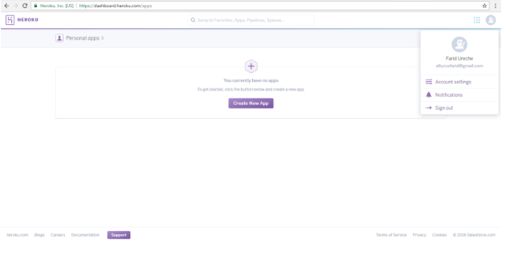
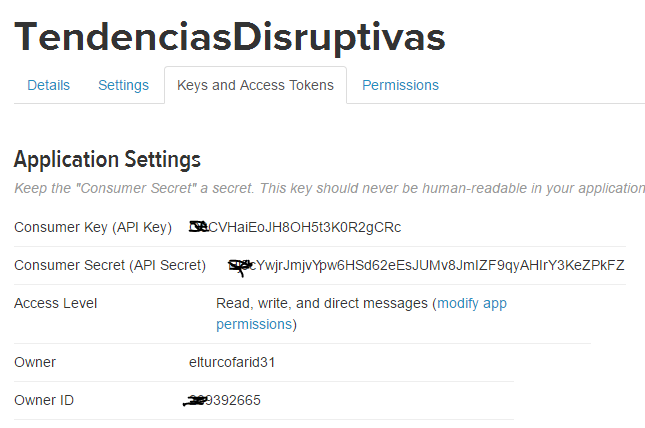
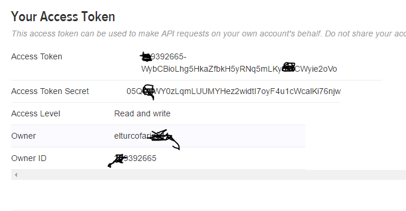

# laboratorio

### 1)	Investigar.

#### a.	 ¿Qué es Git?, ¿Que lo hace diferente a otros sistemas de versionamiento?

#### b.	¿Qué es Github?, ¿Por qué es importante para nosotros en este curso?

### 2) Explicar los siguientes comandos en sus propias palabras. 

**git clone**:
Crea copia de un repositorio, sea local o remoto.

**git pull :** Permite actualizar tu repositorio local con el último commit realizado sobre el repositorio. 

**git push:** Reemplaza master por la rama a la que quieres enviar tus cambios.

**git checkout:** Descargar repositorio o reemplazar cambios en un repositorio local con el contenido del repositorio en GIT.

**git add :**  Registrar cambios y /o a añadir al Index.

**git checkout -b "nombre" :** crea una nueva rama, con el “nombre” especificado.

**git commit -am"primer commit": ** comandoque permite crear una única confirmación.

**git pull rebase: **: Incorpora cambios con respecto a un repositorio remoto en la rama actual.

**git stash **: Se utiliza cuando se desea registrar el estado actual del directorio de trabajo y el índice, pero desea volver a un directorio de trabajo limpio. 

**git stash pop **: Permite retirar un solo estado escondido en la lista escondite y aplicarlo en la parte superior del estado del árbol de trabajo actual, es decir, hacer la operación inversa de git stash save .

**git reset **: Permite copiar entradas de <tree-ish> para el índice. 

###3) Investigar. 

a. ¿Qué significan las siglas IaaS, PaaS, y SaaS? Explique las diferencias con ejemplos prácticos.

Software-as-a-Service (SaaS): El concepto de SaaS ha existido desde hace mucho tiempo, pero quizás en estos últimos años hemos definido claramente a que nos referimos. Básicamente se trata de cualquier servicio basado en la web. Tenemos ejemplos claros como el Webmail de Gmail, los CRM onlines. En este tipo de servicios nosotros accedemos normalmente a través del navegador sin atender al software. Todo el desarrollo, mantenimiento, actualizaciones, copias de seguridad es responsabilidad del proveedor.

En este caso tenemos poco control, nosotros nos situamos en la parte más arriba de la capa del servicio. Si el servicio se cae es responsabilidad de proveedor hacer que vuelva a funcionar.

Ejemplos populares de Saas son Google Docs, Salesforce, Dropbox, Gmail…

Plataform-as-a-Service (PaaS): PaaS es el punto donde los desarrolladores empezamos a tocar y desarrollar nuestras propias aplicaciones que se ejecutan en la nube. En este caso nuestra única preocupación es la construcción de nuestra aplicación, ya que la infraestructura nos la da la plataforma.

Es un modelo que reduce bastante la complejidad a la hora de desplegar y mantener aplicaciones ya que las soluciones PaaS gestionan automáticamente la escalabilidad usando más recursos si fuera necesario. Los desarrolladores aun así tienen que preocuparse de que sus aplicaciones estén lo mejor optimizadas posibles para consumir menos recursos posibles (número de peticiones, escrituras en disco, espacio requerido, tiempo de proceso, etc..) Pero todo ello sin entrar al nivel de maquinas.

Ejemplos populares son Google App Engine que permite desarrollar aplicaciones en Java o Python desplegándolas en la infraestructura que provee Google, cosa que también hace Heroku con Rails y Django.

Para los desarrolladores que ignoran la infraestructura que deben montar y sólo quieren preocuparse de escribir software, esta es la alternativa a seguir.

Infraestructure-as-a-Service (IaaS):  En este caso con IaaS tendremos mucho más control que con PaaS, aunque a cambio de eso tendremos que encargarnos de la gestión de infraestructura,

El ejemplo perfecto es el proporcionado por Amazon Web Service (AWS) que no provee una serie de servicios como EC2 que nos permite manejar maquinas virtuales en la nube o S3 para usar como almacenamiento. Nosotros podemos elegir qué tipo de instancias queremos usar LInux o Windows, así como la capacidad de memoria o procesador de cada una de nuestras maquinas. El hardware para nosotros es transparente, todo lo que manejamos es de forma virtual.

La principal diferencia es que nosotros nos encargamos de escalar nuestras aplicaciones según nuestras necesidades, además de preparar todo el entorno en las maquinas (aunque existen imágenes de instancias preparadas con las configuraciones más comunes).

Además de AWS nos encontramos ejemplos como Rackspace Cloud o vCloud de VMWare.

http://www.genbetadev.com/programacion-en-la-nube/entendiendo-la-nube-el-significado-de-saas-paas-y-iaas

b.	¿Qué es Heroku?

Heroku es una plataforma en la nube que permite a las empresas a construir, entregar, supervisar y aplicaciones escala; es la manera más rápida para ir de la idea al URL, sin pasar por todos esos problemas de infraestructura.

Heroku desarrollada desde junio de 2007, con el objetivo de soportar el lenguaje de programación Ruby, pero después se ha extendido el soporte a Java, Node.js, Scala, Clojure y Python y PHP. La base del sistema operativo es Debian.

James Lindenbaum, Adam Wiggins, y Orion Henry fundaron Heroku. El 8 de diciembre de 2010 Salesforce.com adquirió Heroku como una subsidiaria. El 12 de julio de 2011 Yukihiro “Matz” Matsumoto, el creador de Ruby se unió a la empresa. Ese mismo mes, Heroku incorporó el soporte para Node.js y Clojure.

Actualmente Heroku soporta Cloudant, Couchbase Server, MongoDB y Redis,6 además de la conocida PostgreSQL.

En Heroku tenemos que conocer algo llamado Dynos. Los Dynos son piezas fundamentales del modelo de arquitectura de Heroku, son las unidades que proveen capacidad de cómputo dentro de la plataforma. Están basados en Contenedores Linux.

Cada Dyno está aislado del resto, por lo que los comandos que se ejecutan y los archivos que se almacenan en un Dyno, no afectan a los otros. Además cada Dyno provee el ambiente requerido por las aplicaciones para ser ejecutadas.

Los posibles comandos a ser ejecutados en los dynos incluyen procesos web, o cualquier otro tipo de proceso definido en el archivo Procfile de la aplicación. Este es un archivo de texto ubicado en el directorio raíz de la aplicación, y es el mecanismo provisto para la declaración de comandos que luego correrán los dynos. Básicamente, consiste de una lista de tipos de procesos de la aplicación. Cada tipo de procesos constituye una declaración de un comando.
Principales características

    Elasticidad y crecimiento. La cantidad de Dynos asignados a una aplicación se puede cambiar en cualquier momento a través de la línea de comandos o el dashboard.

    Tamaño. Heroku ofrece diferentes tipos de dynos, cada uno con diferentes capacidades de procesamiento y memoria.

    Routing. Internamente los routers realizan un seguimiento de la ubicación de los Dynos que estén corriendo, y redirigen el tráfico de acuerdo a la misma.

    Seguimiento. Existe un manejador de Dynos, el cual monitorea de forma continua los dynos que se estén ejecutando. En caso de una falla en un Dyno, este es eliminado y creado nuevamente.

    Distribución y redundancia. Los Dynos se encuentran aislados uno de otro. Esto implica que de existir fallos en la infraestructura interna de alguno de ellos, los otros dynos no se ven afectados, y consecuentemente tampoco la aplicación.

http://kawcode.com/tutoriales/que-es-heroku/

###4) Registrarse en la plataforma de Heroku y descargar Heroku Toolbet para desarrollar aplicaciones. Herramientas de Software 

Imagen de creacion de cuenta

###5) ¿Qué es Node.js?
Node.js es una librería y entorno de ejecución de E/S dirigida por eventos y por lo tanto asíncrona que se ejecuta sobre el intérprete de JavaScript creado por Google V8. Lo cierto es que está muy de moda aunque no es algo nuevo puesto que existen librerías como Twisted que hacen exactamente lo mismo pero si es cierto que es la primera basada en JavaScript y que tiene un gran rendimiento.

¿Cuál es su importancia hoy?,
Node.js es un entorno Javascript del lado del servidor, basado en eventos. Node ejecuta javascript utilizando el motor V8, desarrollado por Google para uso de su navegador Chrome. Aprovechando el motor V8 permite a Node proporciona un entorno de ejecución del lado del servidor que compila y ejecuta javascript a velocidades increíbles. El aumento de velocidad es importante debido a que V8 compila Javascript en código de máquina nativo, en lugar de interpretarlo o ejecutarlo como bytecode. Node es de código abierto, y se ejecuta en Mac OS X, Windows y Linux.

¿Por qué muchas empresas en mundo usan Node.js?
Con Node.js las empresas están a la vanguardia tecnológica, se mantienen competitivas con respecto a las soluciones que ofrecen y alivian un poco el problema de reclutar talento.

###6) ¿Qué es EXPRESSJS? De otros ejemplos 
Framework de node JS, se caracteriza por tener las características para las aplicaciones web y móviles.
Ejemplos de framework, basados en Node JS
Juggler, Core.

###7) ¿Qué son los WebSockets?, 
es una tecnología avanzada que hace posible abrir una sesión de comunicación interactiva entre el navegador del usuario y un servidor. Con esta  API, puede enviar mensajes a un servidor y  recibir  respuestas controladas por eventos sin tener que consultar al servidor para una respuesta.
¿Que es Socket.IO?
Socket.io es una librería que nos permite manejar eventos en tiempo real mediante una conexión TCP y todo ello en JavaScript. Es realmente potente y podemos hacer todo tipo de aplicaciones en tiempo real
http://www.nodehispano.com/2012/09/introduccion-a-socket-io-nodejs/

¿Que es Socket.IO? Social media 
Framework de comunicaciòn basado en eventos bidireccional en tiempo real. permite crear chat y mensajería de tiempo real, análisis, contenidos y reportes en tiempo real, documentos colaborativos y streaming binary con el que es posible enviar imágenes, audio y video.
###8) Investigar 
a. ¿Qué es Twitter Streaming API? Dar un ejemplo de su uso en productos comerciales o por parte de alguna empresa. 
Las API de Streaming dan a los desarrolladores acceso de baja latencia a la corriente mundial de Twitter Tweet de los datos. Una aplicación adecuada de un cliente de streaming será empujado mensajes que indican los Tweets y se han producido otros hechos, sin ninguna de la sobrecarga asociada a un sondeo extremo REST.
Dar un ejemplo de su uso en productos comerciales o por parte de alguna empresa.
Por ejemplo, considere una aplicación web que acepta peticiones de los usuarios, hace una o más peticiones a la API de Twitter, a continuación, formatos e imprime el resultado al usuario, como una respuesta a la petición inicial del usuario: 

b. ¿Cómo podría una empresa colombiana usar el Twitter Streaming API? 

###9) Diseñe un proyecto que use el Twitter API, y que añada valor al negocio de una empresa en el contexto Colombiano. Esta pregunta deberá contener una motivación desde el punto de vista de negocio y un diseño holístico de la solución de TI. 

###10) Registrarse para crear una aplicación que use el Twitter Streaming API. Generar las diferentes claves de AUTH2 para poder usar el API. 

### 11) Clone el proyecto https://github.com/UNADTDTI/laboratorio-practico.git, y siga las instrucciones en el archivo README. Después de terminar las modificaciones, despliegue la aplicación web en Heroku, e incluya la URL de la aplicación corriendo.
